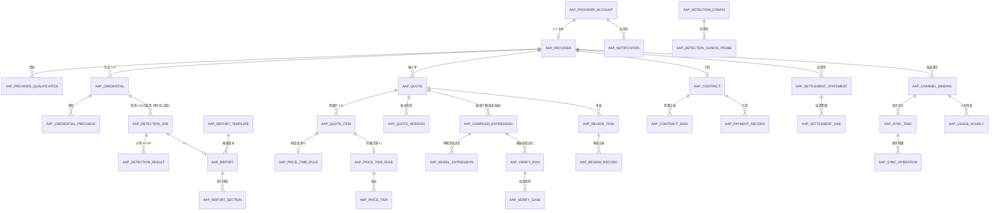

# AAP 服务端 ER 数据模型（PostgreSQL）

> 真源：`.calicat/prd/15-数据模型ER与数据字典.md`（表清单/字段摘要）+ `17-零歧义执行规格spec.md` §3（字段级实体）
> + `aap-client` 已消费字段（`src/utils/*-model.ts`）。
> 本文是**可直接建表**的依据；DDL 落在 `aap-server/src/main/resources/db/migration/V1__baseline.sql`。

## 1. 全局设计约定

| 项 | 约定 |
|---|---|
| 表前缀 | `aap_` |
| 主键 | `id bigint` 雪花（非自增）；对外 JSON **序列化为 string**（决策 D-ID-01） |
| 外键 | **逻辑外键**，不建 DB 级 FK（跨上下文解耦，C12） |
| 时间 | `timestamptz`，UTC 存储；对外 RFC3339（`2026-09-16T00:00:00Z`） |
| 软删除 | `deleted boolean not null default false`，业务唯一索引一律带 `where deleted = false` |
| 乐观锁 | `version int not null default 0`，写接口支持 `If-Match` |
| 金额 | `numeric(18,6)`（单位 USD 或 USD/1M tokens），**禁 float/double** |
| 词元/计数 | `bigint`（小时表亿级） |
| 半结构化 | `jsonb`（`model_list`、`config_snapshot`、`metrics`、`payload`…） |
| 枚举 | `varchar(32)` + 应用层枚举（Java enum），DB 不建 enum 类型（便于加值） |
| 手机号 | `phone_cipher`（AES-256-GCM）+ `phone_hash`（SHA-256，检索/唯一）+ `phone_masked`（展示） |
| 审计字段（业务表通用） | `id, created_at, updated_at, created_by, updated_by, deleted, version` |
| 分页 | 统一 `(created_at desc, id desc)` 复合索引；深分页改 keyset(`cursor`) |

## 2. ER 图（核心域）

## 3. 表清单（53 张，按上下文分组）

| # | 表 | 上下文 | 说明 | 本轮 DDL |
|---|---|---|---|---|
| 1 | `aap_provider_account` | iam | 供应商账号（手机号密文/hash/mask、微信 openid、role、status） | ✅ |
| 2 | `aap_admin_user` | iam | 管理端账号（运营/技术运营/超管） | ✅ |
| 3 | `aap_role` | iam | 角色字典 | ✅ |
| 4 | `aap_user_role` | iam | 用户-角色 | ✅ |
| 5 | `aap_sms_code` | iam | 短信验证码（300s、60s 频控、5 次锁 15 分钟） | ✅ |
| 6 | `aap_wechat_binding` | iam | 微信绑定（openid/unionid） | ✅ |
| 7 | `aap_auth_token` | iam | 刷新令牌（jti、过期、撤销） | ✅ |
| 8 | `aap_provider` | provider | 供应商主体（主状态机 12 态） | ✅ |
| 9 | `aap_provider_qualification` | provider | 资质文件登记 | ✅ |
| 10 | `aap_credential` | credential | 测试凭证（AES-256-GCM 密文、指纹、脱敏、declared_*） | ✅ |
| 11 | `aap_credential_precheck` | credential | 预检记录（连通性/鉴权/模型清单） | ✅ |
| 12 | `aap_provider_challenge` | credential | 端点归属 challenge 签名串 | ✅ |
| 13 | `aap_detection_config` | detection | 检测配置版本（阈值/权重/否决规则） | ✅ |
| 14 | `aap_detection_config_probe` | detection | 检测项明细（D1–D8 启停/权重/超时） | ✅ |
| 15 | `aap_detection_job` | detection | 检测任务（状态机 6 态、总分、结论、成本） | ✅ |
| 16 | `aap_detection_result` | detection | 分项结果（UNIQUE(job_id, probe_code)） | ✅ |
| 17 | `aap_detection_baseline` | detection | 基线库（模型指纹基线） | ✅ |
| 18 | `aap_baseline_sample` | detection | 基线样本 | ✅ |
| 19 | `aap_probe_question` | detection | 行为题库（40 题/难度分层） | ✅ |
| 20 | `aap_report_template` | report | 报告模板版本 | ✅ |
| 21 | `aap_report` | report | 报告（1:1 检测任务） | ✅ |
| 22 | `aap_report_section` | report | 章节快照（四段式解释） | ✅ |
| 23 | `aap_quote` | quote | 报价单（状态机 6 态 + quote_no/version/source_hash） | ✅ |
| 24 | `aap_quote_version` | quote | 版本快照（不可变，C9） | ✅ |
| 25 | `aap_quote_item` | quote | 明细行（八大单价 + 规则引用，UNIQUE(quote_id, model_name)） | ✅ |
| 26 | `aap_price_time_rule` | quote | 时段价规则（tz/weekday_scope/peak_ranges/multiplier） | ✅ |
| 27 | `aap_price_time_segment` | quote | 峰段明细（start/end） | ✅ |
| 28 | `aap_price_tier_rule` | quote | 阶梯价规则（tier_field/price_strategy） | ✅ |
| 29 | `aap_price_tier` | quote | 档位（min/max/label/价格或倍率） | ✅ |
| 30 | `aap_price_request_rule` | quote | 请求级加价规则（`|||` 语法来源） | ✅ |
| 31 | `aap_reference_price` | quote | 参考价（倍率换算基线） | ✅ |
| 32 | `aap_review_task` | review | 审核任务（领取/通过/驳回） | ✅ |
| 33 | `aap_review_record` | review | 审核记录（action/before/after） | ✅ |
| 34 | `aap_contract` | contract | 合同（状态机、sign_channel=OFFLINE） | ✅ |
| 35 | `aap_contract_sign` | contract | 签署记录 | ✅ |
| 36 | `aap_payment_record` | settlement | 打款记录（仅留痕，无资金流转 R-42） | ✅ |
| 37 | `aap_settlement_statement` | settlement | 结算单（周期/平台服务费率） | ✅ |
| 38 | `aap_settlement_line` | settlement | 结算明细行 | ✅ |
| 39 | `aap_compiled_expression` | compilation | 编译产物集（status/source_hash/publish_blocked） | ✅ |
| 40 | `aap_model_expression` | compilation | 单模型表达式（expr/tier_labels/verified） | ✅ |
| 41 | `aap_verify_run` | compilation | 模拟校验运行 | ✅ |
| 42 | `aap_verify_case` | compilation | 校验用例（向量/预期/实际/通过与否） | ✅ |
| 43 | `aap_channel_binding` | sync | 渠道绑定（channel_name AAP-{short}-{seq}、tag） | ✅ |
| 44 | `aap_sync_task` | sync | 同步任务（idempotency_key 唯一、attempt_count、next_retry_at） | ✅ |
| 45 | `aap_sync_operation` | sync | 同步操作明细（请求/响应脱敏、回读一致性） | ✅ |
| 46 | `aap_sync_log` | sync | 同步日志（11-PRD §3 sync_log） | ✅ |
| 47 | `aap_newapi_endpoint` | sync | new-api 端点（base_url/凭据引用/只读标记） | ✅ |
| 48 | `aap_usage_hourly` | usage | 小时用量桶（事实表、唯一 UPSERT、按月分区） | ✅ |
| 49 | `aap_usage_sync_cursor` | usage | 聚合游标 | ✅ |
| 50 | `aap_audit_log` | support | 审计（append-only，四类操作必录 R-47） | ✅ |
| 51 | `aap_notification` | support | 站内信/短信 | ✅ |
| 52 | `aap_file_asset` | support | 文件资产（报告 PDF/资质/凭证截图） | ✅ |
| 53 | `aap_outbox_event` | support | 出箱事件（E01–E42，跨上下文一致性） | ✅ |
| 54 | `aap_idempotency_record` | support | 幂等记录（24h，C11 全局唯一） | ✅ |

> 注：清单编号 54 行含 `aap_idempotency_record`（PRD 归入 support，与 `aap_outbox_event` 同段）。

## 4. 字段字典（按表）

> 标注：`PK` 主键 · `UQ` 唯一 · `IDX` 索引 · `FK*` 逻辑外键 · `AUD` 审计字段（本表不再重复列出）。

### 4.1 iam

**aap_provider_account**
| 字段 | 类型 | 约束 | 说明 |
|---|---|---|---|
| id | bigint | PK | 雪花 |
| phone_cipher | text | | AES-256-GCM 密文（base64(iv‖ct‖tag)） |
| phone_hash | char(64) | UQ(deleted=false) | SHA-256(phone)，检索与唯一 |
| phone_masked | varchar(16) | | `138****8888`（R-48） |
| nickname | varchar(64) | | |
| wx_openid / wx_unionid | varchar(64) | IDX | 微信登录互认（AC-05） |
| role | varchar(32) | | `SUPPLIER`（17-spec §4） |
| status | varchar(32) | | `ACTIVE/SUSPENDED/DISABLED` |
| last_login_at | timestamptz | | |

**aap_admin_user**：`username UQ`、`password_hash`(bcrypt)、`display_name`、`role`(BIZ_OPERATOR/TECH_OPS/SUPER_ADMIN)、`status`、`last_login_at`。

**aap_role**：`code UQ`、`name`、`scope`(PROVIDER/ADMIN)。
**aap_user_role**：`user_id FK*`、`user_type`(PROVIDER/ADMIN)、`role_code`，UQ(user_id,user_type,role_code)。

**aap_sms_code**：`phone_hash IDX`、`scene`(LOGIN/BIND/REVEAL/CONTRACT_SIGN)、`code_hash`（不存明文）、`sent_at`、`expire_at`(300s)、`attempt_count`（>5 锁 15 分钟）、`locked_until`、`used_at`、`client_ip`。

**aap_wechat_binding**：`account_id FK*`、`openid UQ`、`unionid IDX`、`bound_at`。
**aap_auth_token**：`account_id FK*`、`jti UQ`、`refresh_token_hash`、`expire_at`、`revoked_at`、`user_agent`、`client_ip`。

### 4.2 provider

**aap_provider**
| 字段 | 类型 | 约束 | 说明 |
|---|---|---|---|
| id | bigint | PK | |
| provider_no | varchar(32) | UQ | `AAP-P-2026-0001` |
| provider_code | varchar(32) | UQ | `AAP-P-{6位}`（17-spec §3） |
| account_id | bigint | FK* | → aap_provider_account |
| short_name / short_code | varchar(64) | short_code UQ | 渠道名 `AAP-{short_name}-{seq}` 使用（R-36~38） |
| company_name | varchar(128) | | 企业全称 |
| uscc | varchar(18) | UQ(deleted=false) | 统一社会信用代码（E-1104 冲突） |
| industry_category | varchar(32) | | `ORIGINAL/RESELLER/AGGREGATOR` |
| province/city/address/website | varchar | | 客户端字段（D-PRD-01 约定） |
| contact_name | varchar(64) | | |
| contact_phone_cipher / contact_phone_hash / contact_phone_mask | text/char(64)/varchar(16) | | 密文+检索+脱敏 |
| contact_title / contact_email | varchar | | 职务/邮箱（D-PRD-01 约定） |
| company_intro | text | | 公司简介（D-PRD-01 约定） |
| completeness | smallint | | 完整度 0–100（服务端计算：必填项填充率，**唯一口径在服务端**） |
| status | varchar(32) | IDX | 12 态主状态机（17-spec §4） |
| recheck_interval_days | int | default 30 | 复测间隔（AC-49） |
| manual_override | boolean | | 人工放行 |
| override_reason | text | | `manual_override=true` 时必填（R-47a） |
| operator_tags | jsonb | | 运营标签 |
| last_detection_job_id | bigint | | 最近检测任务 |
| published_at / suspended_at / suspend_reason | | | 上架/暂停留痕 |

**aap_provider_qualification**：`provider_id FK*`、`category`(BUSINESS_LICENSE/AUTHORIZATION/OTHER)、`file_id`、`file_name`、`file_size`、`content_type`、`status`(UPLOADED/VERIFIED/REJECTED)、`uploaded_at`。

### 4.3 credential

**aap_credential**
| 字段 | 类型 | 约束 | 说明 |
|---|---|---|---|
| id | bigint | PK | |
| provider_id | bigint | FK* IDX | |
| alias | varchar(64) | | 凭证名（客户端 `alias`） |
| primary_flag | boolean | 部分 UQ(provider_id) where primary_flag | C1 同供应商仅 1 条主凭证 |
| base_url | varchar(255) | | http/https，规范化去尾斜杠保留 `/v1`（R-04） |
| api_key_cipher | text | | AES-256-GCM，base64(iv‖ct‖tag)（R-06） |
| api_key_mask | varchar(32) | | `sk-****abcd`（R-05） |
| api_key_fingerprint | char(64) | UQ(provider_id, api_key_fingerprint) | SHA-256（AC-09 重复 E-1104） |
| declared_vendor | varchar(64) | | 申报厂商 |
| declared_rpm / declared_tpm / declared_context_window | int | | 申报限速/上下文（D4/D5 评分依据） |
| model_list | jsonb | | `[{model_name,model_id,context_window,rpm}]` |
| env_tag | varchar(32) | | 客户端 `env_tag`（约定） |
| status | varchar(32) | IDX | `PENDING_PRECHECK/PRECHECK_PASSED/PRECHECK_FAILED/ACTIVE/INVALID` |
| detection_status | varchar(32) | | 派生列（列表页 chips）：`PENDING/RUNNING/PASS/FAIL` |
| latest_report_id | bigint | | 派生列（列表页「报告」入口） |
| precheck_passed | boolean | | |
| precheck_at / last_used_at | timestamptz | | |

**aap_credential_precheck**：`credential_id FK*`、`status`(PASSED/FAILED)、`connectivity_ok`、`auth_ok`、`models_ok`、`error_code`、`latency_ms`、`checked_at`。
**aap_provider_challenge**：`provider_id`、`challenge_code`、`signature`、`verified_at`。

### 4.4 detection

**aap_detection_config**：`version_no UQ`、`name`、`pass_score`(70)、`veto_rule`(jsonb：`{probe:"D7",lt:40}`)、`status`(DRAFT/PUBLISHED/SUPERSEDED)、`published_at/by`。
**aap_detection_config_probe**：`config_id FK*`、`probe_code`(D1–D8)、`probe_name`、`enabled`、`weight`（归一化前）、`timeout_seconds`（D1–D3/D6–D8=180，D4/D5=600）、`params`(jsonb)。

**aap_detection_job**
| 字段 | 类型 | 说明 |
|---|---|---|
| id | bigint PK | |
| job_no | varchar(32) UQ | `DJ{yyyyMMdd}{seq}` |
| provider_id / credential_id | bigint IDX | |
| trigger_type | varchar(16) | FIRST/MANUAL/SCHEDULED |
| status | varchar(32) IDX | QUEUED/RUNNING/PARTIAL_DONE/COMPLETED/REPORT_GENERATED/FAILED（17-spec §4） |
| active_flag | boolean | 部分 UQ(credential_id) where active_flag → C2 互斥（E-1301） |
| config_snapshot | jsonb | 冻结快照 |
| started_at / finished_at | timestamptz | |
| total_score | numeric(5,2) | round 2 位（R-24） |
| result | varchar(16) | PASS/FAIL/MANUAL_REVIEW（R-25） |
| confidence | varchar(16) | HIGH/MEDIUM/LOW |
| cost_estimate_usd / cost_actual_usd | numeric(18,6) | 成本保护默认 $2（R-12） |
| challenge_verified | boolean | |
| error_code / error_msg | | |
| attempt_count | int | |
| progress_percent / progress_finished / progress_total / eta_minutes | | 客户端 `progress{}`（约定） |

**aap_detection_result**：`job_id FK*`、`probe_code`、`probe_name`、`status`(SUCCESS/FAILED/SKIPPED/NOT_MEASURABLE)、`score numeric(5,2)`、`weight_original/weight_used numeric(6,4)`、`metrics jsonb`（按项结构）、`evidence text`（脱敏）、`evidence_url`、`explanation text`（四段式）、`attempt_count`，**UQ(job_id, probe_code)**。

**aap_detection_baseline**：`model_name IDX`、`vendor`、`tokenizer_probe jsonb`、`behavior_vector jsonb`、`context_max int`、`source`、`baseline_version`（基线版本号；**不叫 `version`**——`version` 是审计乐观锁列，同名会撞车）。
**aap_baseline_sample**：`baseline_id FK*`、`sample_type`(TOKENIZER/BEHAVIOR/CONTEXT)、`payload jsonb`。
**aap_probe_question**：`difficulty`(EASY/MEDIUM/HARD)、`prompt`、`expected_type`、`weight`、`enabled`。

### 4.5 report

**aap_report_template**：`template_no UQ`、`version_no`、`title`、`logo_file_id`、`section_order jsonb`、`disclaimer text`、`status`(DRAFT/PUBLISHED/SUPERSEDED)。
**aap_report**
| 字段 | 类型 | 说明 |
|---|---|---|
| id | bigint PK | |
| report_no | varchar(32) UQ | `RP{yyyyMMdd}{seq}` |
| job_id | bigint UQ | 1:1 检测任务 |
| provider_id / credential_id | bigint | |
| template_id / template_snapshot | bigint/jsonb | |
| total_score / result / confidence | | 快照 |
| veto_triggered | boolean | D7 一票否决（R-20） |
| verdict | text | 结论措辞（**禁"正品"** R-26） |
| provider_name / provider_code | | 报告抬头 |
| api_key_masked | varchar(32) | |
| model_list | jsonb | |
| detected_at / duration_seconds | | |
| cost_estimate_usd / cost_actual_usd | numeric(18,6) | |
| rendered_html | text | `/reports/{id}/html` |
| pdf_file_id | bigint | 导出 PDF |
| disclaimer | text | 免责声明 |
| status | varchar(16) | GENERATED/PUBLISHED |

**aap_report_section**：`report_id FK*`、`section_code`(A–F)、`section_name`、`avg_score numeric(5,2)`、`scored boolean`、`note`、`items jsonb`（`[{code,name,metric,score,status,value}]`）、`seq`。

### 4.6 quote

**aap_quote**：`quote_no UQ`(`Q{yyyyMMdd}{6位}`)、`provider_id IDX`、`credential_id`、`name`/`title`、`status`(DRAFT/SUBMITTED/IN_REVIEW/REJECTED/APPROVED/CONTRACT_CREATED/CONVERTED/VOID)、`current_version int`、`currency`(USD)、`valid_from`/`valid_to`、`item_count`、`remark`、`reject_reason_code`/`reject_reason_text`、`submitted_at/by`、`withdrawn_at`、`reviewed_by/at`、`approved_quote_version`、`contract_id`、`last_compilation_id`、`source_hash`、**UQ(quote_no)**。
**aap_quote_version**：`quote_id FK*`、`version_no`、`snapshot jsonb`（不可变 C9）、`created_by/at`，UQ(quote_id, version_no)。
**aap_quote_item**：`quote_id FK*`、`model_name`、`model_alias`、`input_price/output_price`(≥0 必填)、`cache_read_price/cache_write_price/cache_write_1h_price`、`image_input_price/audio_input_price/image_output_price/audio_output_price`、`compile_status`、`note`、`tier_label`、`billing_mode`，**UQ(quote_id, model_name)**（C3）。
**aap_price_time_rule**：`item_id UQ`、`tz`(IANA，默认 Asia/Shanghai)、`weekday_scope`(ALL/WEEKDAY/WEEKEND)、`peak_multiplier`(>0)、`offpeak_multiplier`(>0)、`peak_price_override`。
**aap_price_time_segment**：`time_rule_id FK*`、`start_time time`、`end_time time`、`seq`（允许跨零点，段间不重叠）。
**aap_price_tier_rule**：`item_id UQ`、`tier_field`(固定 `len`)、`price_strategy`(OVERRIDE/MULTIPLY)。
**aap_price_tier**：`tier_rule_id FK*`、`seq`、`min_value`(首档 0)、`max_value`(末档 null)、`label`、`input_price/output_price/cache_read_price`（OVERRIDE）、`multiplier`（MULTIPLY）。
**aap_price_request_rule**：`item_id FK*`、`when_expr`（如 `header('anthropic-beta') has 'fast-mode'`）、`multiplier`(>0)、`enabled`。
**aap_reference_price**：`model_name`、`vendor`、`input_price/output_price`（参考价，用于倍率换算）、`effective_from/to`。

### 4.7 review / contract / settlement

**aap_review_task**：`quote_id FK*`、`provider_id`、`status`(PENDING/CLAIMED/APPROVED/REJECTED)、`claimed_by/at`、`tech_reviewed_by/at`、`tech_metrics_snapshot jsonb`、`review_comment`、`reject_reason_code`、`version`（乐观锁，E1 并发领取）。
**aap_review_record**：`quote_id`、`task_id`、`action`(ASSIGN/TECH_REVIEW/APPROVE/REJECT/WITHDRAW)、`operator_id`、`before_status/after_status`、`comment`、`snapshot jsonb`。
**aap_contract**：`contract_no UQ`、`quote_id`、`provider_id`、`title`、`status`(CREATED/PENDING_SIGN/SUPPLIER_SIGNED/SIGNED/ARCHIVED/VOIDED)、`sign_channel`(OFFLINE，R-41)、`cooperation_mode`、`valid_from/valid_to`、`settlement_cycle`、`platform_fee_rate numeric(6,4)`、`currency`、`min_settlement_amount numeric(18,6)`、`sign_deadline`、`signer_name/signer_phone_masked`、`sign_method`、`terms jsonb`、`file_id`(PDF ≤20MB)、`signed_at`、`archived_at`、`voided_reason`。
**aap_contract_sign**：`contract_id FK*`、`signer_type`(SUPPLIER/PLATFORM)、`signer_name`、`sign_method`(SMS/SEAL)、`sms_code_id`、`signed_at`、`tone`(success/pending/void，客户端签署记录时间轴)。
**aap_payment_record**：`provider_id`、`contract_id`、`statement_id`、`amount numeric(18,6)`、`currency`、`status`(UNSETTLED/PAYMENT_RECORDED/CONFIRMED/VOID)、`voucher_file_id`(凭证截图必填 C5)、`paid_at`、`confirmed_by/at`、`remark`。
**aap_settlement_statement**：`statement_no`、`provider_id`、`period_from/period_to`、`total_amount`、`platform_fee`、`status`。
**aap_settlement_line**：`statement_id FK*`、`channel_id`、`model_name`、`total_tokens`、`quota_raw`、`amount`。

### 4.8 compilation

**aap_compiled_expression**：`quote_id IDX`、`quote_version int`（冻结）、`provider_id`、`status`(DRAFT/COMPILED/VERIFIED/VERIFY_FAILED/CONFIRMED/PUBLISHED/SUPERSEDED)、`gate_status`(COMPILED/VERIFIED/CONFIRMED/REJECTED)、`source_hash char(64) UQ`（R-34 幂等）、`compiler_version`、`previous_expr jsonb`（回滚快照）、`confirmed_by/at`、`publish_blocked boolean`（未确认禁止同步红线）、`verify_report jsonb`。
**aap_model_expression**：`compilation_id FK*`、`model_name`、`expr_version`(v1)、`expr text`、`tier_labels jsonb`、`rule_hits jsonb`、`verified boolean`、`source_hash`、`inline_expanded text`，UQ(compilation_id, model_name)。
**aap_verify_run**：`compilation_id FK*`、`status`(PASSED/FAILED)、`case_total`、`case_passed`、`failed_field`、`started_at/finished_at`。
**aap_verify_case**：`run_id FK*`、`case_code`(V1–V6)、`case_name`、`input jsonb`（token 向量/时刻）、`expected numeric(18,8)`、`actual numeric(18,8)`、`passed boolean`、`diff_note`。

### 4.9 sync / usage

**aap_channel_binding**：`provider_id`、`credential_id`、`endpoint_id`、`channel_id`(new-api)、`channel_name UQ`(`AAP-{short_name}-{seq}`)、`tag`(=provider_code)、`group_name`、`priority`、`weight`、`models jsonb`、`status`(NOT_SYNCED/SYNCED/ENABLED/DISABLED/PARTIAL/FAILED/PENDING/SYNCING/ROLLED_BACK)、`last_synced_at`、`last_readback_hash`、`online_channel_snapshot jsonb`。
**aap_sync_task**：`task_no UQ`、`binding_id`、`provider_id`、`compilation_id`、`task_type`(ADD_CHANNEL/UPDATE_CHANNEL/WRITE_PRICE/ENABLE/DISABLE/SYNC_MODELS)、`status`(PENDING/RUNNING/SUCCESS/FAILED/MANUAL/SKIPPED)、`payload jsonb`（key 脱敏）、`idempotency_key UQ`（C11）、`attempt_count`、`next_retry_at`、`last_error`、`readback_equal boolean`。
**aap_sync_operation**：`task_id FK*`、`operation`、`request_payload`/`response_payload jsonb`（脱敏）、`result`、`readback_equal`、`attempt_no`、`error`。
**aap_sync_log**：`provider_id`、`channel_id`、`operation`、`idempotency_key`、`request_payload`、`response_payload`、`result`、`readback_equal`、`attempt_no`、`error`、`operator_id`。
**aap_newapi_endpoint**：`name`、`base_url`、`api_key_cipher`、`readonly boolean`、`status`。
**aap_usage_hourly**（事实表，按月 `stat_hour` RANGE 分区）
| 字段 | 类型 | 说明 |
|---|---|---|
| id | bigint | 雪花 |
| stat_hour | timestamptz | UTC 整点 |
| channel_id / channel_name | | 渠道 |
| provider_id | bigint | 渠道未映射置空并告警（U5） |
| model_name / group_name | varchar | 维度键 |
| request_count | bigint | 请求数 |
| prompt_tokens / completion_tokens / total_tokens | bigint | 词元 |
| cache_read_tokens / cache_write_tokens / cache_write_1h_tokens | bigint | 缓存三件套（F8 自建补齐） |
| image_input_tokens / audio_input_tokens / video_input_tokens | bigint | 多模态（`video_*` 为 D-PRD-01 约定扩展） |
| quota_raw | numeric(18,6) | 计费额度 |
| cost_usd | numeric(18,6) | 折算金额 |
| tier_distribution | jsonb | 档位分布 `{"t1_base":120000,...}` |
| cache_parse_status | varchar(32) | `OK/NO_CACHE_FIELD`（U2，不可解析记 0） |
| source | varchar(16) | LOG_API/LOG_DB |
| batch_id | bigint | 聚合批次 |
| collected_at | timestamptz | |
| **UQ(stat_hour, channel_id, model_name, group_name)** | | UPSERT 幂等（C7/AC-44） |

**aap_usage_sync_cursor**：`data_source`(LOG_API/LOG_DB)、`cursor_hour`、`last_run_at`、`last_batch_id`、`status`。

### 4.10 support

**aap_audit_log**（append-only，DB 仅 INSERT/SELECT 授权）：`trace_id IDX`、`actor_type`(PROVIDER/ADMIN/SYSTEM)、`actor_id/name/ip`、`user_agent`、`action`(CREDENTIAL_REVEAL/QUOTE_APPROVE/SYNC_WRITE_PRICE/…)、`target_type/target_id`、`summary`、`before_value`/`after_value`（脱敏）、`result`、`risk_level`(NORMAL/SENSITIVE)。
**aap_notification**：`recipient_type`(PROVIDER/ADMIN)、`recipient_id IDX`、`channel`(SMS/INBOX/BOTH)、`event_code`、`title`、`content`（脱敏）、`biz_type/biz_id`、`read_at`、`status`(PENDING/SENT/FAILED)、`category`（客户端 chip：订单/系统）。
**aap_file_asset**：`file_key UQ`、`bucket`、`original_name`、`content_type`、`size_bytes`、`sha256`、`biz_type`、`encrypted`、`status`、`expire_at`。
**aap_outbox_event**：`event_id UQ`、`aggregate_type/id/version`、`event_type`(E01–E42)、`payload jsonb`、`status`(NEW/DISPATCHED/FAILED/DEAD)、`attempt_count`、`next_retry_at`、IDX(status, next_retry_at)。
**aap_idempotency_record**：`idempotency_key UQ`、`actor`、`endpoint`、`request_hash`、`response_status`、`response_body jsonb`、`state`(IN_PROGRESS/DONE)、`expire_at`（24h）。

## 5. 关键约束（与 PRD §5 一一对应）

| 编号 | 约束 | 落地方式 |
|---|---|---|
| C1 | 同供应商 1 条主凭证 | 部分唯一索引 `uq_credential_primary(provider_id) where primary_flag and not deleted` |
| C2 | 同凭证同时仅 1 活跃检测任务 | 部分唯一索引 `uq_job_active(credential_id) where active_flag` + 应用层预检（E-1301） |
| C3 | 同报价单模型不重复 | UQ(quote_id, model_name) |
| C4 | 每明细行至多 1 条时段/阶梯规则 | UQ(item_id) on price_time_rule / price_tier_rule |
| C5 | 阶梯/时段区间无重叠无空洞 | 应用层 `QuoteConflictValidator`（编译前闸门①） |
| C6 | 仅 verified+CONFIRMED 才可同步 | `publish_blocked` + SyncService 前置校验（E-1407/AC-33） |
| C7 | 用量桶唯一 UPSERT | UQ(stat_hour, channel_id, model_name, group_name) + `ON CONFLICT DO UPDATE` |
| C8 | 审计不可变 | 仅 INSERT/SELECT；`updated_at` 不更新 |
| C9 | 报价版本不可变 | 版本快照表只插不改 |
| C10 | 编译确认后不可变 | 新确认置旧 `SUPERSEDED` |
| C11 | 幂等键全局唯一 | UQ(idempotency_key)（任务表 + 幂等记录表） |
| C12 | 跨上下文不联表写 | 按包边界 + 出箱事件 |

## 6. 索引与性能要点

- 列表 P95<500ms：`(过滤列, created_at desc, id desc)`；深分页 keyset。
- 调度器：`FOR UPDATE SKIP LOCKED` + `idx_job_status_created(status, created_at)`。
- 用量表：按月 RANGE 分区，唯一索引含 `stat_hour`；聚合 UPSERT 批量化。
- 大 jsonb（`metrics`/`payload`/`rendered_html`）**不建 GIN**。
- 业务唯一索引一律带 `where deleted = false`。
- 供应商端首屏 P95<800ms：`/usage/summary` 走小时表预聚合查询 + 覆盖索引 `(provider_id, stat_hour)`。

## 7. 数据生命周期

| 数据 | 保留 | 处置 |
|---|---|---|
| `aap_audit_log` | 永久（热库 12 个月） | 冷数据导出对象存储 |
| `aap_usage_hourly` | 永久 | 超 24 月 detach 分区转对象存储 |
| `aap_sync_task` | 18 个月 | 归档 |
| `aap_detection_result.evidence` | 12 个月 | 证据文件转对象存储，报告正文保留 |
| `aap_sms_code` | 7 天 | 物理删除 |
| `aap_idempotency_record` | 24h | 过期清理任务 |
| `aap_notification` | 90 天 | 物理删除（可按需保留） |
| `aap_auth_token` | 过期后 30 天 | 物理删除 |

## 8. 变更记录

- 2026-09-17 首版：由 `aap-client` 已实现页面 + 22 份 PRD 反推，覆盖 54 张表（PRD 53 + 幂等记录单列）。
